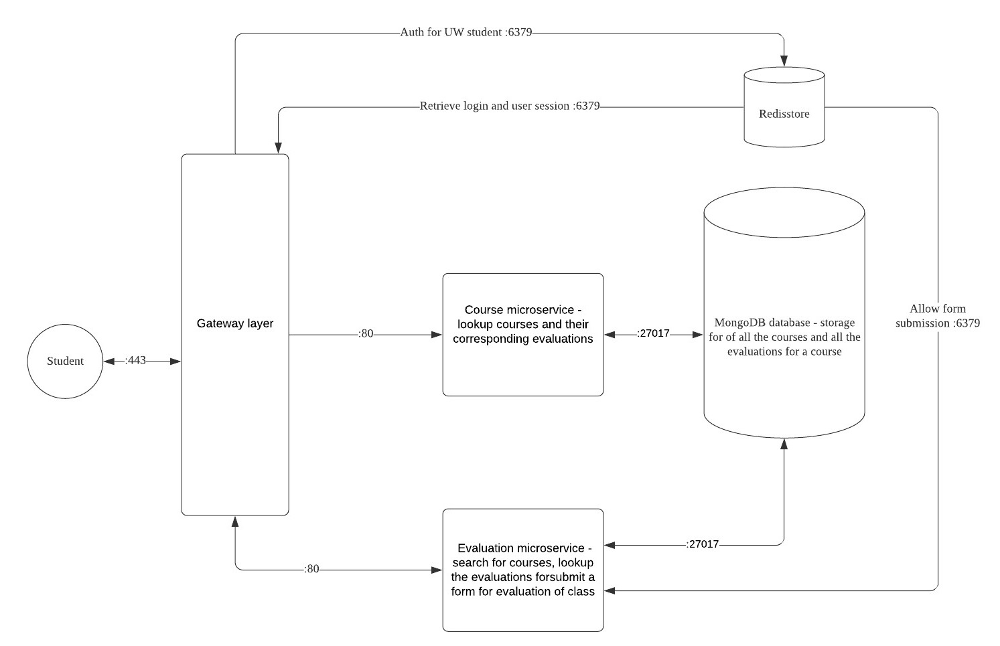
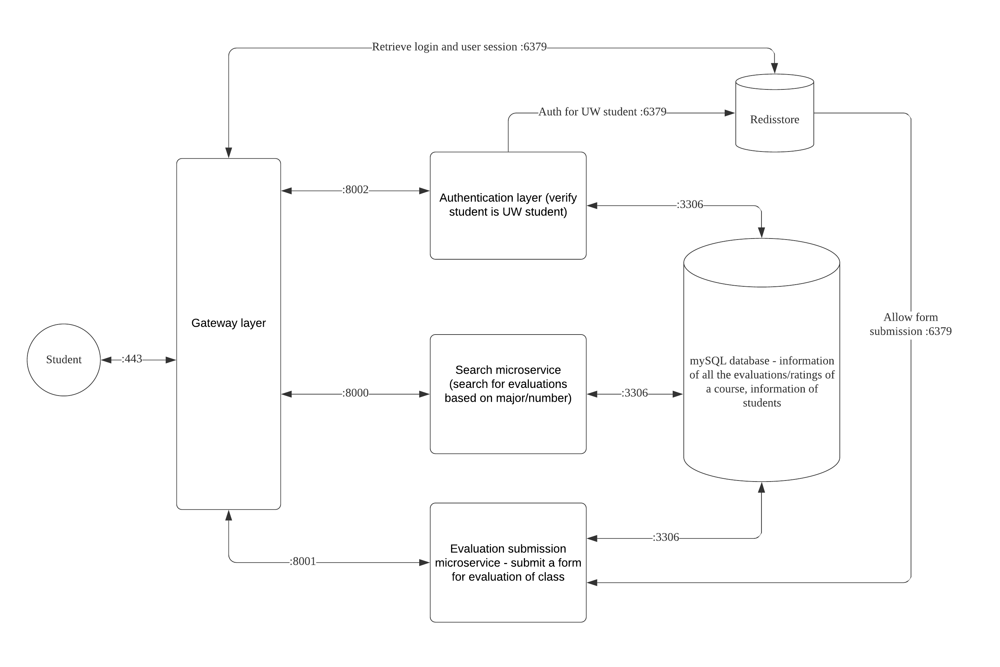

# Project Proposal

## Project Description 
<p> 
Currently there is no resource for UW students to see specific reviews and suggestions about a particular course. Similar services, such as RateMyProfessor focuses on the professors themselves, while UW course evaluation only displays numerical ratings without much explanation for the course structure, details, or helpful suggestions. As UW students and developers, we want to solve this issue by building an application **UW Course Eval** to help UW students make more informed decisions about the classes they want to take: by creating an application where they are able to see reviews for a particular course and view the difficulty of the course, see the recommendations from other students, and able to submit reviews/evaluations of a course anonymously.
</p>

## Technical Description
### Architectural diagram mapping 

User Client \
Gateway layer - verify student is UW student, receive session information \
Redis session store - save session information \
Mongoose database - information of all the evaluations/ratings of a course \
Course microservice - search for evaluations based on major/number \
Evaluation microservice - submit a form for evaluation of class


https://lucid.app/invitations/accept/ceac9f69-1f24-4728-9327-78fdd456e2b0

### User Stories and Priority

| Priority | User | Description | Technical Implementation Strategy |
| --- | --- | --- | --- |
| P0 | As a student | I want to be able to search for all the evaluations for a particular course submitted by all students | Access the Mongoose database, return a response body that will be displayed in the front-end |
| P0 | As a student | I want to be able to submit a evaluation of a course I took | Insert into the Mongoose database, provide a request to the back-end |
| P0 | As a student | I want to be able to Sign in and Sign up as user | Store log in credentials in database, authenticate user and store sessions inside Redis database. |
| P1 | As a student | I want to be able to update my evaluation after submisssion | User clicks on edit button, updates the fields,  save evaluation updates in Mongoose database |
| P1 | As a student | I want to be able to update the information in my profile after sign up | Update the MySQL Users database, return a response displayed on the front-end |

## API EndPoints
### User 
`v1/user`: saves users who make accounts 
* `GET` (`application/json`) : to get a specific user account based on User ID. 
 * 200: Successful response with user information 
 * 401: Cannot verify User ID .
 * 415: Cannot decode body or receive unsupported body.
 * 500: Internal server error.

* `POST` (`application/json`) : to create new user account, Sign up
 * 201: created new user account
 * 400: bad request if user account already exists
 * 401: unauthorized user information access
 * 500: internal server error
 
* `PATCH` (`application/json`) : to update user email Id or password
 * 201: updated user information
 * 400: bad request if user account already exists
 * 401: unauthorized user information access
 * 500: internal server error

### Session
`/v1/sessions`: saves user session when logged in 
* `POST` (`application/json`) : Post new user session
 * 201: created a new session for a user on sign in
 * 415: unsupported media
 * 500: internal server error

* `GET` (`application/json`) : Get current user session
 * 400: bad request
 * 403: forbidden request if not user's session

* `DELETE`: Delete user session after user logs out
 * 400: bad request
 * 403: forbidden request if not user's session

### Course 
`v1/courses` :  information on all the courses 
* `GET` (`application/json`) : to get all courses in the database
 * 200: Successful response with course information 
 * 500: Internal server error

`v1/courses/{courseID}` :  to retrieve information on specific courses 
* `GET` (`application/json`) : to get information on the specific courses in the databse
 * 200: Successful response with course information 
 * 500: Internal server error

`v1/courses/{courseID}/evaluations` :  to retrieve all evaluations on specific courses \
* `GET` (`application/json`) : to get information on the specific courses in the databse
 * 200: Successful response with course information 
 * 500: Internal server error

### Evaluation
`v1/evaluations`: information on all the evaluations submitted 
* `POST` (`application/json`): to add evaluation to a course
 * 201: Created new evaluation  
 * 401: Unauthorized user information access
 * 500: Internal server error
 
`v1/evaluations/{id}`: information on the specific evaluation submitted 
* `PATCH` (`application/json`) : to update evaluation text description, rating etc
 * 201: Updated evaluation parameters
 * 401: Unauthorized user information access
 * 500: Internal server error

* `DELETE`: students who posted the evaluations will be able to delete their evaluations 
 * 200: Successfully deletes student evaluations.
 * 401: Cannot verify review ID
 * 500: Internal server error

## Data Models
We use MongoDB as our data storage for courses and evaluations, Redis as the storage for sessions, and MYSQL for the user data.

 * **Evaluation**: The courses are evaluated and reviewed by students. The evaluations are specific to a course. A single course can have multiple evaluations based on the quarter, year and instructors involved. One user can submit only one evaluation per course. User will be able to edit and delete evaluations.

```
	evaluation: { 
		id: int 
		studentID: int 
		courseID: int 
		instructurs: [string] (multiple instructors can be included separated by ‘ , ’ or ‘ ; ‘) \
		year: date 
		quarter : string 
		creditType: string 
		credits: int 
		workload: int  (on a scale of 1-10, with 1 being the least amount of work and 10 being the most work) 
		gradingTechniques: int (on a scale of 1-5, with 1 being the easiest grading technique and 5 being the most difficult grading technique) 
		description: string	
		likedUsers: [int] ( list of unique studentIDs who have liked the evaluation. The length of the array provides count of likes. Need to check if the studentID exists before adding to the list, to maintain unique studentIDs) 
		dislikedUsers: [int] ( list of studentIDs who disliked the course) 
	}
```
 * **Course**: The evaluations are specific to a course. This data model contains course information such as Course Title, Course Code, Credits and a brief Description text.
```
	course: { 
		id: int 
		code: string 
		title: string 
		description: string 
		credits: int 
	}
```

 * **Student**: represents student information
```
	student: { 
		id :  int64 
		email:  string 
		passhash: []byte 
		userName: string 
		firstName: string 
		lastName:  string 
		avatarPhotoURL:  string 
	}
```
 * **NewStudent**: represents new student information, used during user registration
```
	newStudent: { 
		email: string 
		password: string 
		passwordConf: string 
		userName: string 
		firstName: string 
		lastName: string 
	}
```
 * **Student Credentials**: used during user login 
```
	credentials: { 
		email: string 
		password: string 
	}
```

## Initial Infrastructure Diagram



